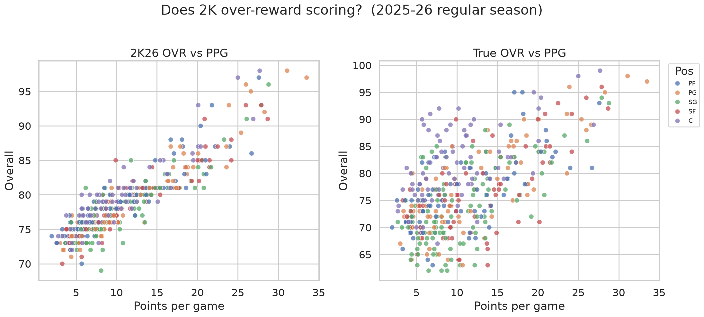

# True Analytics OVR vs 2K26

Season: **2025-26** regular season. Qualified players: GP ≥ 15 and MPG ≥ 10.

## How to read this

- **2K OVR** — current roster overall from 2kratings.com (2K26).
- **True OVR** — heuristic overall from PER, TS%, BPM/VORP, usage×efficiency, and defensive rates.
- **OVR gap** = 2K − True. Positive ⇒ 2K is higher (overrated *relative to this model*). Negative ⇒ hidden gem.

This is a v1 model. The weights are in `src/nba_ovr/settings.py` — change them and re-run stages 4–5.

## Scoring bias check

Pearson correlation of PPG vs rating:

| Rating | corr(PPG, rating) |
| --- | --- |
| 2K26 OVR | 0.906 |
| True OVR | 0.611 |

If the left number is clearly larger, the video game is leaning on points more than the box-score impact stats.

## Top 10 overrated (2K ≫ True OVR)

| player_name | team_abbreviation | position | gp | pts | per | ovr_2k | true_ovr | ovr_gap |
| --- | --- | --- | --- | --- | --- | --- | --- | --- |
| Ace Bailey | UTA | SF | 72 | 13.80 | 11.60 | 81.00 | 63 | 18.00 |
| Will Riley | WAS | SF | 74 | 10.30 | 12.10 | 81.00 | 64 | 17.00 |
| Bub Carrington | WAS | PG | 82 | 10.70 | 9.90 | 78.00 | 63 | 15.00 |
| Tre Johnson | WAS | SG | 60 | 12.20 | 10.60 | 78.00 | 63 | 15.00 |
| Cody Williams | UTA | SG | 67 | 8.80 | 9.60 | 76.00 | 62 | 14.00 |
| Nique Clifford | SAC | SG | 75 | 8.60 | 9.00 | 77.00 | 63 | 14.00 |
| Aaron Nesmith | IND | SF | 45 | 13.80 | 10.80 | 80.00 | 66 | 14.00 |
| Jaylen Wells | MEM | SG | 69 | 12.50 | 11.50 | 79.00 | 66 | 13.00 |
| Rui Hachimura | LAL | PF | 68 | 11.50 | 11.60 | 81.00 | 68 | 13.00 |
| Nolan Traoré | BRK | PG | 56 | 8.90 | 7.90 | 77.00 | 64 | 13.00 |

## Top 10 underrated / hidden gems (True OVR ≫ 2K)

| player_name | team_abbreviation | position | gp | pts | per | ovr_2k | true_ovr | ovr_gap |
| --- | --- | --- | --- | --- | --- | --- | --- | --- |
| Paul Reed | DET | C | 65 | 7.80 | 24.20 | 79.00 | 92 | -13.00 |
| Goga Bitadze | ORL | C | 64 | 5.90 | 20.10 | 77.00 | 89 | -12.00 |
| Robert Williams | POR | C | 59 | 6.70 | 22.10 | 80.00 | 91 | -11.00 |
| Neemias Queta | BOS | C | 76 | 10.20 | 20.30 | 81.00 | 92 | -11.00 |
| Jalen Duren | DET | C | 70 | 19.50 | 26.10 | 85.00 | 95 | -10.00 |
| Mitchell Robinson | NYK | C | 60 | 5.70 | 21.10 | 80.00 | 90 | -10.00 |
| Day'Ron Sharpe | BRK | C | 62 | 8.70 | 20.50 | 78.00 | 88 | -10.00 |
| Luke Kornet | SAS | C | 68 | 6.50 | 17.90 | 78.00 | 88 | -10.00 |
| Chet Holmgren | OKC | PF | 69 | 17.10 | 21.60 | 86.00 | 95 | -9.00 |
| Sandro Mamukelashvili | TOR | C | 80 | 11.20 | 18.10 | 79.00 | 87 | -8.00 |

## Caveats

- Play-by-play defensive events are optional. If `raw_data/pbp/` is empty (stats.nba.com blocked), True OVR leans on BBRef STL/BLK per 100 and DBPM.
- 2K ratings include reputation, **potential**, and recency. High-school lottery wings will look “overrated” here on purpose: the model only sees this season’s box score.
- Backup centers with huge PER in 12–18 MPG used to spike True OVR; v1 shrinks composites by total minutes (`minutes_credibility`).
- A “gap” is not automatically a mistake by 2K.
- Name matching can miss two-way players and duplicate names. See `processed_data/unmatched_2k.csv`.
